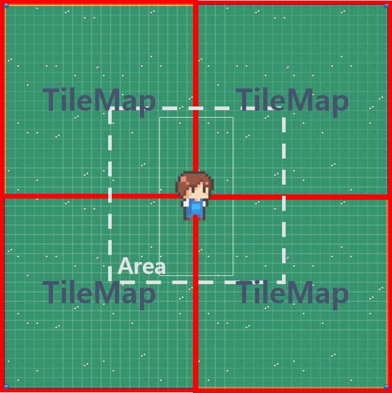
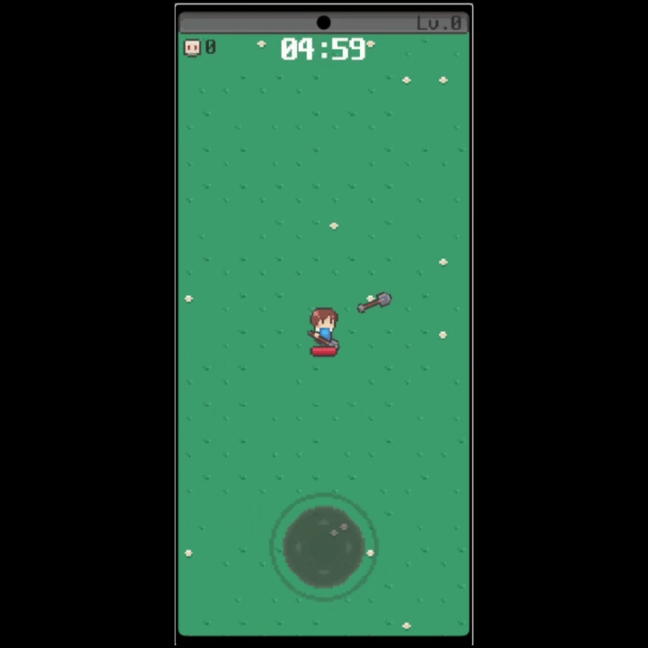
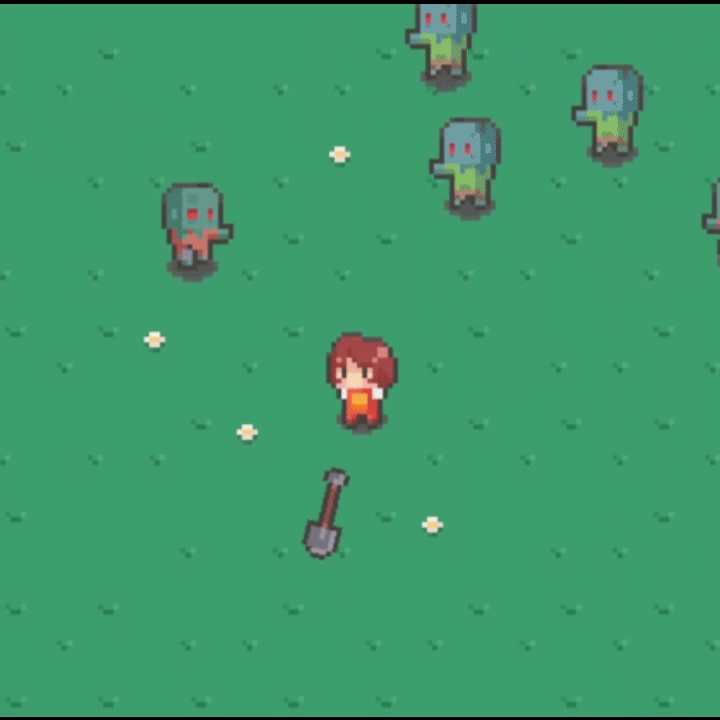

# SL_Unity_Portfolio(SurvivorsLike)

### <h3>프로젝트 설명</h3>  
- 뱀서라이크 일종의 게임으로 기능 중심 및 유니티 다루기 위주로 개발  
- Object Pool을 활용하여 메모리 활용  
- 이외 캐릭터 특성별(패시브) 작업, 무기 및 아이템 강화 적용 등 작업  

> ### <h3>개발 작업</h3>  
<h1>Contents</h1>  

> <h3>재배치</h3>  
    
 tilemap 혹은 enemy가 특정 범위(Area)를 벗어나면 플레이어 이동에 맞춰 위치 조정

> <h3>오브젝트 풀</h3>  
   
    
 Enemy 혹은 Player Weapon 등 할당 해제가 빈번하게 발생할 요소들을 Pool로 관리하여 재사용

> <h3>해금</h3>  
   
   
 특정 조건에 따른 해금 시스템으로 조건 달성 시 해금 된 캐릭터 플레이 가능

> <h3>강화</h3>  
    
 
   
 무기 및 장비 아이템 강화(인게임 적용이 아닌 테스트 화면)  
 레벨 단계별로 각 수치 추가 적용  
 최대 레벨 도달시 버튼 비활성화  

 > <h3>사운드</h3>  
    
 BGM, SFX 사운드 별 관리  
 SFX의 경우 한 번에 많은 오브젝트가 처리 될 때 과부하 및 큰 사운드 발생하는 우려를 줄이고자 채널로 관리

<h1>Player</h1>  

> <h3>이동</h3>  
    
 InputSystem Joystick을 활용하여 이동 적용

> <h3>무기</h3>
 근거리 원거리로 분류하여 무기 생성  
 - 삽(근거리)  
   
    무기 강화 시 무기 개수 원형 재배치 및 대미지 적용  
    원형 재배치 시 오브젝트 풀에 있는 무기를 파악하여 위치 재정비 및 풀링 추가    
    
 - 엽총(원거리)  
   
    무기 강화 시 관통 횟수 및 대미지 적용  
    엽총 발사 시 플레이어 스캔 작업(원형 캐스트)을 통해 가장 가까이 있는 적을 향해 발사    

 - 낫(원거리)  
   
    무기 강화 시 관통 횟수 및 대미지 적용  
    일정 시간마다 낫을 던지며 플레이어 이동 방향에 따라 던져지는 방향이 다름(Idle 상태시 좌우 랜덤)

> <h3>장비 및 소비 아이템</h3>
 플레이어 능력치 관련 장비 아이템과 1회성 소비 아이템  
 - 장갑(장비)  
    무기에 따른 배율(회전 속도 및 쿨타임 등) 증가    
 - 신발(장비)  
    플레이어 이동 속도 증가    
 - 음료(소비)  
    플레이어 최대 체력 적용    
 - 자석(소비)  
   
 인게임에 활성화 된 경험치 코인(Pool) 흡수

<h1>Enemy</h1>

> <h3>이동</h3>  
    
 Target(플레이어) 방향으로 이동

> <h3>스폰</h3>  
    
 랜덤 이용하여 플레이어에 부착된 스폰 포인트 위치 중 특정 스폰 포인트 인덱스 위치에 스폰  
 게임 레벨에 따른 스폰되는 Enemy 타입 변화

> <h3>경험치 코인</h3>  
    
 Enemy Dead 시 Enemy 타입에 따른 경험치 코인 랜덤 Init

<h1>UI</h1>

> <h3>GameStart</h3>  
    
 게임 시작화면  
 해금 미해금에 따른 버튼 활성 비활성화 작업  
 버튼마다 플레이할 캐릭터의 ID 및 정보 지정  
 버튼으로 선택하여 인게임 진입 시 해당 플레이어 정보로 게임 실행  

> <h3>HUD</h3>  
    
 인게임 표시 UI들(경험치, 처치 수, 레벨, 시간, 체력)

> <h3>레벨업</h3>  
    
 레벨업 시 선택 UI  
 Vertical Layer Group을 이용하여 존재하는 Item UI를 생성한 후 3개만 활성화 작업  
 랜덤을 활용하여 나온 값의 정보(ID로 분류)를 통해 3가지만 활성화 

 > <h3>결과</h3>  
   
    
 플레이 결과에 따른 결과창 UI   
 플레이어가 죽었는지, 게임 플레이 시간이 다 됐는지에 따라 결과창에 대한 정보 활성화가 달라짐  

 > <h3>알림</h3>  
   
    
 해금 관련 알림